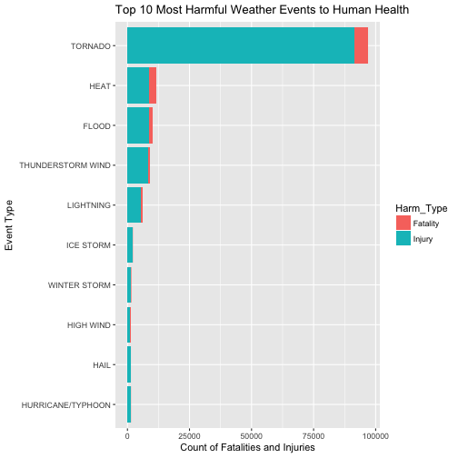
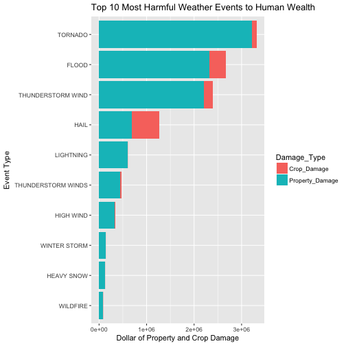

# Synopsis

<span style = "color: red"> This is my second R markdown document for Project 2 in Reproducible Research course. Thank you for the time and efforts in reviewing my document. </span>  
Storms and other severe weather events can cause both public health and economic problems for communities and municipalities. Many severe events can result in fatalities, injuries, and property damage, and preventing such outcomes to the extent possible is a key concern.
This project involves exploring the U.S. National Oceanic and Atmospheric Administration's (NOAA) storm database. The database tracks characteristics of major storms and weather events in the United States, including when and where they occur, as well as estimates of any fatalities, injuries, and property damage.
The goal of the study is to explore the NOAA Storm Database and condcut analysis about the severe weather events using tables, figures and other summaries to solve the following questions:
* Across the United States, which types of events are most harmful with respect to population health?
* Across the United States, which types of events have the greatest economic consequesces?

# Data Processing

The dataset for this assignment is downloaded from course website from Coursera and you can get the file downloaded from [here](https://d396qusza40orc.cloudfront.net/repdata%2Fdata%2FStormData.csv.bz2)   
Explicit description of the dataset is also available at [National Weather Service Storm Data Documentation](https://d396qusza40orc.cloudfront.net/repdata%2Fpeer2_doc%2Fpd01016005curr.pdf)  
Frequently asked questions (FAQ) are available at [National Climatic Data Center Storm Events FAQ](https://d396qusza40orc.cloudfront.net/repdata%2Fpeer2_doc%2FNCDC%20Storm%20Events-FAQ%20Page.pdf)  
The events in the data spans from 1950 to Nov 2011. There are generally fewer events recordered in the earlier years due to a lack of good records and more complete data in recent years.   

* Loading libraries

```r
library(knitr)
library(dplyr)
library(ggplot2)
library(reshape2)
```

* Loading data and subset the data to what we need


```r
if(!file.exists("StormEvents.csv.bz2")){
   download.file("https://d396qusza40orc.cloudfront.net/repdata%2Fdata%2FStormData.csv.bz2", method = "curl","StormEvents.csv.bz2")
}
storm <- read.csv(bzfile("StormEvents.csv.bz2"), sep = ",", stringsAsFactors = FALSE, header = TRUE)
storm.sub <- subset(storm, select = c("BGN_DATE", "EVTYPE", "FATALITIES","INJURIES","PROPDMG", "PROPDMGEXP","CROPDMG", "CROPDMGEXP"))
```

* Data cleaning  

To clean up the formats of the data for better report display and more accurate calculation for the follwing analysis. Especially, the property and crop damage exponentials need to be fixed by replacing letters to the corresponding exponential numbers and missing data need replacing by 0.


```r
#convert the date data to the correct format
storm.sub$BGN_DATE <- as.Date(storm.sub$BGN_DATE, format = "%m/%d/%Y")
#convert the property damage with it exponential to readable dollar and replace the missing value by 0
storm.sub$PropDmgExp <- 0
storm.sub$PropDmgExp[storm.sub$PropDmgExp == "H" | storm.sub$PropDmgExp == "h"] <- 2
storm.sub$PropDmgExp[storm.sub$PropDmgExp == "K" | storm.sub$PropDmgExp == "k"] <- 3
storm.sub$PropDmgExp[storm.sub$PropDmgExp == "M" | storm.sub$PropDmgExp == "m"] <- 6
storm.sub$PropDmgExp[storm.sub$PropDmgExp == "B" | storm.sub$PropDmgExp == "b"] <- 9
storm.sub$PropDmgExp[storm.sub$PropDmgExp == "+" | storm.sub$PropDmgExp == "-" | storm.sub$PropDmgExp == "?"] <- 0
storm.sub$PropDmgDollar <- ifelse(is.na(storm.sub$PROPDMG), 0, storm.sub$PROPDMG * 10^(storm.sub$PropDmgExp))
#convert the crop damage with it exponential to readable dollar and replace the missing value by 0
storm.sub$CropDmgExp <- 0
storm.sub$CropDmgExp[storm.sub$CropDmgExp == "H" | storm.sub$CropDmgExp == "h"] <- 2
storm.sub$CropDmgExp[storm.sub$CropDmgExp == "K" | storm.sub$CropDmgExp == "k"] <- 3
storm.sub$CropDmgExp[storm.sub$CropDmgExp == "M" | storm.sub$CropDmgExp == "m"] <- 6
storm.sub$CropDmgExp[storm.sub$CropDmgExp == "B" | storm.sub$CropDmgExp == "b"] <- 9
storm.sub$CropDmgExp[storm.sub$CropDmgExp == "?"] <- 0
storm.sub$CropDmgDollar <- ifelse(is.na(storm.sub$CROPDMG), 0, storm.sub$CROPDMG * 10^(storm.sub$CropDmgExp))
#Clean up the event type names
storm.sub$EVTYPE <- gsub("TSTM", "THUNDERSTORM", storm.sub$EVTYPE)
storm.sub$EVTYPE <- gsub("EXCESSIVE HEAT", "HEAT", storm.sub$EVTYPE)
storm.sub$EVTYPE <- gsub("FLASH FLOOD", "FLOOD", storm.sub$EVTYPE)
```
#Results
Now that we have the clean data, we can look at the questions and try to explore the answer to it with plots.  

* Across the United States, which types of events are most harmful with respect to population health?  

This stacked bar chart picks top 10 event types that cause the most injuries and fatalities since 1950 till 2011.


```r
#summarize the total fatalites and injuries by event type
health_smry <- storm.sub %>% group_by(EVTYPE) %>% summarise(Fatality = sum(FATALITIES), Injury = sum(INJURIES), Total = Fatality + Injury) %>% arrange(desc(Total))
#filter for the top 10 events and add rank to it
health_top10 <- health_smry[c(1:10), c(1:3)]
health_top10$Rank <- c(1:10)
#reshape data to long format
health_top10_long <- melt(health_top10, id = c("EVTYPE", "Rank"), na.rm = TRUE)
names(health_top10_long) <- c("Event_Type", "Rank", "Harm_Type", "Sum")
#Plot the stacked bar chart to show the impact of event types on human health
g_health <- ggplot(health_top10_long, aes(x = reorder(Event_Type, -Rank), y = Sum, fill = Harm_Type))
g_health + geom_bar(stat = "identity") + coord_flip() +  ggtitle("Top 10 Most Harmful Weather Events to Human Health") + ylab("Count of Fatalities and Injuries") + xlab("Event Type")
```



* Across the United States, which types of events have the greatest economic consequesces?  
This stacked bar chart picks top 10 event types that cause the most propery damage and crop damage dollar since 1950 till 2011.

```r
#summarize the total property damage and crop damage dollar by event type
econ_smry <- storm.sub %>% group_by(EVTYPE) %>% summarise(Crop_Damage = sum(CropDmgDollar), Property_Damage= sum(PropDmgDollar), Total = Property_Damage + Crop_Damage) %>% arrange(desc(Total))
#filter for the top 10 events and add rank to it
econ_top10 <- econ_smry[c(1:10), c(1:3)]
econ_top10$Rank <- c(1:10)
#reshape data to long format
econ_top10_long <- melt(econ_top10, id = c("EVTYPE", "Rank"), na.rm = TRUE)
names(econ_top10_long) <- c("Event_Type", "Rank", "Damage_Type", "Sum")
#Plot the stacked bar chart to show the impact of event types on human health
g_econ <- ggplot(econ_top10_long, aes(x = reorder(Event_Type, -Rank), y = Sum, fill = Damage_Type))
g_econ + geom_bar(stat = "identity") + coord_flip() +  ggtitle("Top 10 Most Harmful Weather Events to Human Wealth") + ylab("Dollar of Property and Crop Damage") + xlab("Event Type")
```



#Summary
We can conclude that Tornado is the most harmful event in the United States in the history. If we can better monitor and forecast the weather change, we should invest more forecast efforts in Tornados.
